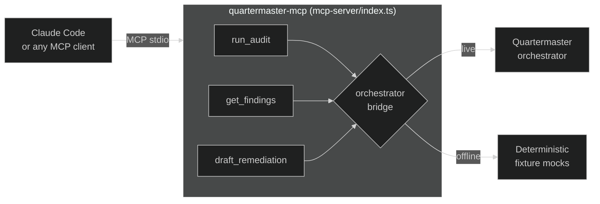
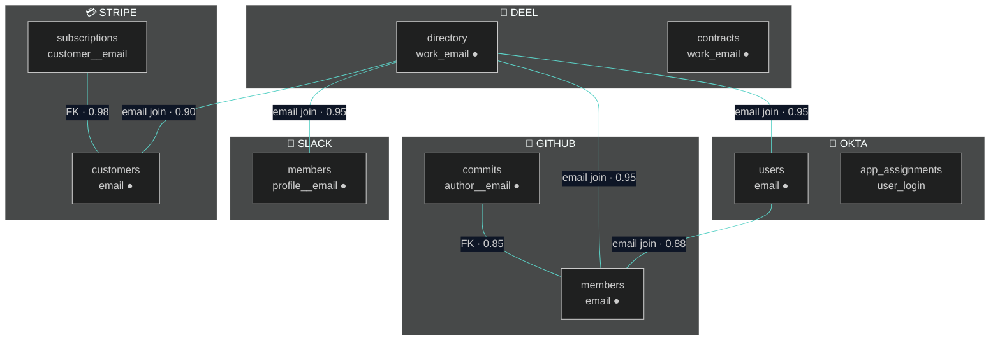
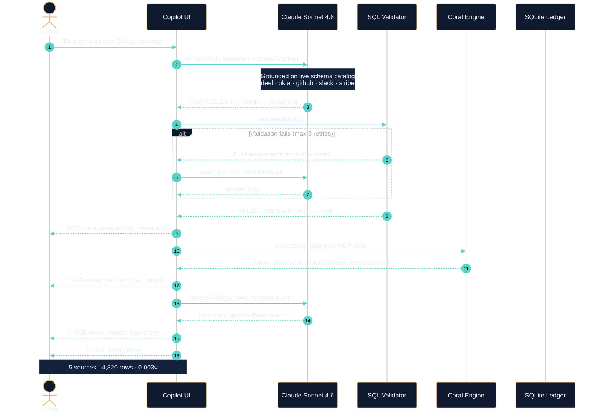
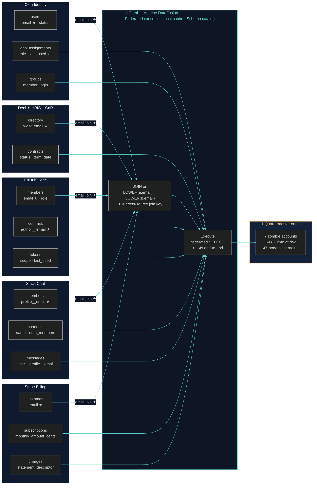

<div align="center">


**Find $4,820/mo of SaaS waste. In 1.4 seconds. One SQL query. Nothing leaves your laptop.**

<br/>

[](https://withcoral.com)
[](https://anthropic.com)
[](https://nextjs.org)
[](https://typescriptlang.org)
[](https://wemakedevs.org/hackathons/coral)
[](LICENSE)

<br/>

```sql
-- One query. Five sources. 1.4 seconds.
WITH offboarded AS (SELECT work_email FROM deel.directory WHERE is_active = false)
SELECT o.work_email, gh.role AS github_role, sl.id AS slack_id, ok.status AS okta_status
FROM offboarded o
LEFT JOIN github.members  gh ON LOWER(gh.email)          = LOWER(o.work_email)
LEFT JOIN slack.members   sl ON LOWER(sl.profile__email) = LOWER(o.work_email)
LEFT JOIN okta.users      ok ON LOWER(ok.email)          = LOWER(o.work_email)
WHERE gh.login IS NOT NULL OR sl.id IS NOT NULL OR ok.login IS NOT NULL;
-- → 7 zombie accounts · $4,820/mo at risk · 47 systems exposed
```

<br/>

[**Try the demo →**](https://github.com/Sushant6095/Quatermaster-coral#quickstart) &nbsp;·&nbsp; [**See the architecture →**](#architecture) &nbsp;·&nbsp; [**Watch the 3-min demo**](#demo)

</div>

---

## What is Quartermaster?

Quartermaster is a **local-first SaaS security audit agent** that runs federated SQL across your HRIS, identity provider, code platform, chat, and billing — in a single query — to find **zombie accounts**, **ghost seats**, **shadow IT**, and **compliance drift**.

> Think BetterCloud or Torii, but running in your terminal. No warehouse. No ETL. No vendor reviewing your employee list. Your data stays on your machine.

**The stack:**
- **[Coral](https://withcoral.com)** — federated SQL engine that joins Deel + Okta + GitHub + Slack + Stripe over MCP stdio, query-time
- **[Claude Sonnet 4.6](https://anthropic.com)** — compiles natural language to federated SQL, narrates findings, drafts Slack/Jira remediations
- **Next.js 15** — the UI and SSE orchestration layer
- **better-sqlite3** — local audit history and ledger, no cloud state

---

## Demo

<div align="center">

> **`pnpm demo`** — fixture mode, works offline, no tokens needed

| Screen | What you see |
|--------|-------------|
| **Cockpit** | Real-time risk score, 5 audit tiles, live finding feed |
| **QM Copilot** | Type a question → SQL streams in → rows arrive in 1.4s → Claude narrates |
| **Audit Run** | SQL types character-by-character → findings pop in with staggered animation |
| **Blast Radius** | Click Mark Reyes → 47-node Three.js force graph of every system he touched |
| **Schema Graph** | 6 source swimlanes, 16 tables, 14 auto-detected join edges |
| **Compliance Ledger** | SHA-256 signed audit trail, SOC2-exportable evidence packs |

</div>

---

## Five named audits

| ID | Name | Sources | Question |
|----|------|---------|----------|
| **QM-01** | 🧟 Zombie Account Hunter | Deel · Okta · GitHub · Slack | Terminated employees with active seats, admin roles, or open PRs |
| **QM-02** | 🔑 Permission Drift | Okta · GitHub · Deel | Elevated permissions unused for 90+ days |
| **QM-03** | 👻 Ghost-Seat Spend | Stripe · GitHub · Deel | Paid seats with zero activity — quantified in $/mo |
| **QM-04** | 🕵️ Shadow-IT Detector | Stripe · Slack | Off-approved-list charges cross-referenced with Slack mentions |
| **QM-05** | 📜 Compliance Ledger | Deel · Okta · GitHub · Slack · Stripe | SOC2 evidence pack per terminated employee |

Each audit is **one SQL file** in [`src/lib/audits/registry.ts`](src/lib/audits/registry.ts). No hidden logic, no black box.

---

## Five killer features

<details>
<summary><strong>⚡ QM Copilot — Natural language to federated SQL</strong></summary>

Hit `⌘J` anywhere in the app. Ask in plain English:

> *"Find me people who left in the last 30 days and still have GitHub commits."*

Claude Sonnet 4.6 compiles the SQL using Coral's live schema catalog as grounding, validates it against an allow-list of schemas, retries on failure (up to 3×), executes via Coral, and narrates the result — including per-row rationale strings.

**Right-rail meta shows:** `5 sources · 4,820 rows scanned · 412 in / 86 out tokens · 0.003¢`

```
User question → compileSQLWithRetry() → validateSQL() → Coral MCP → narrateFindings()
                      ↑ 3 retries with validator error feedback
```

</details>

<details>
<summary><strong>🔴 Continuous Mode — Live finding feed</strong></summary>

Toggle **Live** in the top bar. Quartermaster polls QM-01 every 30 seconds, diffs against a keyed cache, and emits only net-new findings as SSE events to the Cockpit's Live Feed.

**Demo beat:** Flip a Deel sandbox worker to `is_active = false` via curl:
```bash
curl -X PATCH "https://api.letsdeel.com/rest/v2/people/$WORKER_ID" \
  -H "Authorization: Bearer $DEEL_API_TOKEN" \
  -d '{"is_active": false}'
```
Within ≤5 seconds, a P0 zombie row animates into the Live Feed at the top of the Cockpit.

</details>

<details>
<summary><strong>💥 Blast Radius — Every system one account touches</strong></summary>

Click any finding → slide-over opens → click **View Blast Radius**.

Quartermaster builds a reachability graph from the principal email: repos, secrets, Slack channels, Stripe subscriptions, Linear issues, on-call rotations. The result renders as a Three.js force-directed graph with 47+ nodes, each typed and colored by system.

- Central node: the person (gold, 1.5× size)
- Repos: `--color-sea`, Channels: `--color-text-muted`, Secrets: `--color-coral`, Services: `--color-lime`
- Click any node → SQL evidence popover
- Export PNG via browser print

**Mark Reyes fixture:** 47 nodes · 5 sources · $42,800 estimated risk

</details>

<details>
<summary><strong>🔌 Quartermaster-as-MCP-Server — Audits as tools</strong></summary>

Quartermaster speaks MCP back out. Register it in Claude Code:

```bash
claude mcp add quartermaster -- npx tsx /absolute/path/to/quartermaster/mcp-server/index.ts
```

Three tools land in any MCP-aware client:

| Tool | Input | Output |
|------|-------|--------|
| `run_audit` | `{ auditId: "QM-01" \| ... }` | Summary + finding count |
| `get_findings` | `{ auditId?, severity? }` | Finding[] |
| `draft_remediation` | `{ findingId, channel }` | Drafted message |

Try: *"Use Quartermaster to check for offboarded contractors with active GitHub admin, then draft Jira tickets for the P0s."*

Falls back to deterministic mocks when the orchestrator isn't running — the demo always works.



</details>

<details>
<summary><strong>🗺️ Schema Graph — Auto-detected join keys</strong></summary>

`/schema` renders all 6 sources as React Flow swimlanes with 16 tables and 14 auto-detected join edges (email joins ranked 0.85–0.98 confidence, FK edges at 0.97–0.98).



Click any two table nodes → **Generate SQL →** navigates to `/playground` with the JOIN pre-populated:

```sql
SELECT *
FROM deel.directory
LEFT JOIN github.members
  ON LOWER(deel.directory.work_email) = LOWER(github.members.email)
LIMIT 50;
```

</details>

---

## Quickstart

### Fixture mode (no tokens needed)

```bash
git clone https://github.com/Sushant6095/Quatermaster-coral.git
cd Quatermaster-coral
pnpm install
pnpm demo          # QM_FIXTURES=on · http://localhost:3000
```

That's it. Every audit, the Copilot, the Live Feed, Blast Radius, the MCP server — all work against bundled fixture data. No API keys, no Coral binary, no Wi-Fi.

### Live mode (real sources)

```bash
# 1. Install Coral
brew install withcoral/tap/coral

# 2. Isolate the workspace
export CORAL_CONFIG_DIR=$(pwd)/.coral-workspace

# 3. Add sources
coral source add --file ./sources/deel/manifest.yaml   # custom spec
coral source add github slack okta stripe              # bundled sources

# 4. Set tokens + Anthropic key
cp .env.example .env.local
# fill in ANTHROPIC_API_KEY, DEEL_API_TOKEN, GITHUB_TOKEN, ...

# 5. Run
pnpm dev           # http://localhost:3000
```

Verify everything at `/sources` — all five dots should be green.

---

## Architecture

### ⚙️ Full system

```mermaid
%%{init: {'theme': 'dark', 'themeVariables': {'primaryColor': '#13213A', 'primaryTextColor': '#E8EEF7', 'primaryBorderColor': '#E4B66B', 'lineColor': '#5BD2C7', 'secondaryColor': '#0F1A2E', 'tertiaryColor': '#070E1A', 'clusterBkg': '#0F1A2E', 'titleColor': '#E4B66B', 'edgeLabelBackground': '#0F1A2E', 'nodeTextColor': '#E8EEF7'}}}%%
flowchart TB
    subgraph UI["🖥  Browser — Next.js 15 · React 19 · Three.js · anime.js"]
        direction LR
        LP[Landing Page\nThree.js Compass]
        CK[Risk Cockpit\nLive Feed]
        CP[QM Copilot\nNL → SQL]
        AR[Audit Runner\nSQL Stream]
        BR[Blast Radius\nForce Graph]
        SG[Schema Graph\nSwimLanes]
        LG[Compliance\nLedger]
    end

    subgraph API["⚡  Next.js API Routes — Node 22 · better-sqlite3"]
        direction LR
        R1[/audits/run\nSSE stream]
        R2[/copilot/ask\nSSE stream]
        R3[/continuous/stream\nSSE heartbeat]
        R4[/findings/:id/\nblast-radius]
        R5[/ledger\nSHA-256 chain]
        R6[/schema/graph\nauto-join keys]
    end

    subgraph CORAL["🔗  Coral — Apache DataFusion over MCP stdio"]
        FE[Federated\nExecutor]
        SC[Schema\nCatalog]
        LC[Local Row\nCache + TTL]
        FE <--> SC
        FE <--> LC
    end

    subgraph CLAUDE["🤖  Claude Sonnet 4.6 — Anthropic SDK"]
        SA[SQL Author\ncompileSQL]
        FN[Finding\nNarrator]
        RD[Remediation\nDrafter]
    end

    subgraph SOURCES["📡  Data Sources"]
        D[("Deel ✦\nHRIS + Contractors")]
        O[("Okta\nIdentity")]
        G[("GitHub\nCode + Commits")]
        S[("Slack\nChat + Channels")]
        ST[("Stripe\nBilling")]
    end

    UI -->|HTTP + SSE| API
    API -->|MCP stdio| CORAL
    API -->|Anthropic SDK| CLAUDE
    CORAL -->|REST APIs| SOURCES

    classDef ui fill:#13213A,stroke:#E4B66B,color:#E8EEF7
    classDef api fill:#0F1A2E,stroke:#5BD2C7,color:#E8EEF7
    classDef coral fill:#0E1626,stroke:#5BD2C7,color:#5BD2C7
    classDef claude fill:#0E1626,stroke:#FF7A6B,color:#FF7A6B
    classDef source fill:#13213A,stroke:#22324F,color:#9AA7BD
    class LP,CK,CP,AR,BR,SG,LG ui
    class R1,R2,R3,R4,R5,R6 api
    class FE,SC,LC coral
    class SA,FN,RD claude
    class D,O,G,S,ST source
```

> **Data never leaves your machine.** Coral caches source rows locally. The orchestrator joins them at query time. Claude sees only column names and aggregate counts — never raw employee PII.

---

### 🧠 QM Copilot — NL → Federated SQL pipeline



---

### 🔴 Continuous Mode — Live diff engine

```mermaid
%%{init: {'theme': 'dark', 'themeVariables': {'primaryColor': '#13213A', 'primaryTextColor': '#E8EEF7', 'primaryBorderColor': '#A8E063', 'lineColor': '#A8E063', 'secondaryColor': '#0F1A2E', 'tertiaryColor': '#070E1A', 'edgeLabelBackground': '#0F1A2E'}}}%%
flowchart LR
    subgraph LOOP["⏱  Continuous Loop  (every 30s)"]
        direction TB
        T[Tick starts]
        RQ["runAudit('QM-01')\nSSE async iterator"]
        ROWS[Collect all\nrow events]
        DIFF{Diff vs\ncache}
        CACHE[("Map＜email, Finding＞\nCache")]
        NEW[New findings\nnet of cache]
        EMIT[Emit to\nEventEmitter]
        UPDATE[Update cache]
        WAIT[Wait for next tick\nQM_CONTINUOUS_INTERVAL]
        T --> RQ --> ROWS --> DIFF
        DIFF -->|unchanged| WAIT
        DIFF -->|new rows| NEW --> EMIT --> UPDATE --> WAIT
        CACHE --> DIFF
        UPDATE --> CACHE
        WAIT --> T
    end

    subgraph SSE["📡  SSE Endpoint  /api/continuous/stream"]
        Q[Event queue\ndrain on each GET]
        HB[Heartbeat\nevery 15s]
    end

    subgraph CLIENT["🖥  Cockpit Client"]
        ES[EventSource\nopen when Live = ON]
        LF[LiveFeed state\nmax 50 items]
        UI[Animate in\n200ms fade + slide]
        ES --> LF --> UI
    end

    EMIT --> Q
    Q -->|finding event| ES
    HB -->|ping| ES

    style LOOP fill:#0F1A2E,stroke:#A8E063
    style SSE fill:#0E1626,stroke:#5BD2C7
    style CLIENT fill:#13213A,stroke:#E4B66B
```



---

### 💥 Blast Radius — Reachability graph

```mermaid
%%{init: {'theme': 'dark', 'themeVariables': {'primaryColor': '#13213A', 'primaryTextColor': '#E8EEF7', 'primaryBorderColor': '#FF7A6B', 'lineColor': '#FF7A6B', 'secondaryColor': '#0F1A2E', 'tertiaryColor': '#070E1A', 'edgeLabelBackground': '#0E1626', 'nodeTextColor': '#E8EEF7', 'clusterBkg': '#0F1A2E'}}}%%
flowchart TB
    subgraph INPUT["🔍  Input: principal email"]
        PE["mark.reyes@acme.corp"]
    end

    subgraph QUERIES["⚡  Coral reachability queries (parallel)"]
        Q1["github.members\n→ repos via collaborators"]
        Q2["slack.members\n→ channels via membership"]
        Q3["github.repository_secrets\n→ secrets via repo set"]
        Q4["linear.issues\n→ assignee matches"]
        Q5["stripe.customers\n→ billing email match"]
    end

    subgraph GRAPH["🕸  Graph Construction"]
        NODES["47 BlastNodes\nperson · repo · channel\nsecret · service"]
        EDGES["~60 BlastEdges\nadmin · member · reads-secret\nbills-to · assignee"]
    end

    subgraph RENDER["🎨  Three.js Force Graph"]
        CENTER["Central node\ngold · 1.5× · glowing"]
        REPO["Repo nodes\n--color-sea"]
        CHAN["Channel nodes\n--color-text-muted"]
        SECRET["Secret nodes\n--color-coral · P0 glow"]
        SERVICE["Service nodes\n--color-lime"]
    end

    subgraph ACTIONS["🖱  Interactions"]
        CLICK["Node click\n→ SQL evidence popover"]
        EXPORT["Export PNG\n→ renderer.domElement.toDataURL()"]
        CLOSE["ESC → close modal\n→ return to audit run"]
    end

    PE --> Q1 & Q2 & Q3 & Q4 & Q5
    Q1 & Q2 & Q3 & Q4 & Q5 --> NODES & EDGES
    NODES & EDGES --> CENTER & REPO & CHAN & SECRET & SERVICE
    RENDER --> CLICK & EXPORT & CLOSE

    style INPUT fill:#0F1A2E,stroke:#FF7A6B
    style QUERIES fill:#0E1626,stroke:#5BD2C7
    style GRAPH fill:#13213A,stroke:#E4B66B
    style RENDER fill:#0F1A2E,stroke:#FF7A6B
    style ACTIONS fill:#0E1626,stroke:#22324F
```



---

### 🗺️ Coral federation — 5 sources, 1 query



**Data never leaves your machine.** Coral caches source rows locally. The orchestrator joins them at query time. Claude sees only column names and aggregate counts — never raw employee PII.

**Every finding is reproducible.** SQL template + source rows = finding. No black box, no hidden enrichment pipeline.

---

## Repository layout

```
src/
├── app/                    Next.js App Router
│   ├── page.tsx            Landing page (standalone, Three.js compass)
│   ├── cockpit/            Risk dashboard + live feed
│   ├── audits/[id]/        Audit run with SSE SQL streaming
│   ├── copilot/            NL→SQL Copilot chat
│   ├── findings/[id]/      Finding detail + Blast Radius modal
│   ├── ledger/             Compliance timeline + SHA-256 evidence pack
│   ├── schema/             React Flow schema swimlanes
│   ├── playground/         SQL editor with JOIN pre-population
│   └── api/                Server routes (SSE, Coral proxy, ledger, health)
├── components/
│   ├── landing/            Hero · Stats · Audits · Federation · CTA
│   ├── cockpit/            StatCard · AuditTile · LiveFeed
│   ├── audit-run/          SQLPanel (typing animation) · ResultGrid
│   ├── finding-detail/     FindingSlideOver · BlastRadiusModal · EvidenceCard
│   ├── ledger/             LedgerEntry · EvidencePack (SHA-256 display)
│   └── layout/             AppShell · LeftRail · TopBar
└── lib/
    ├── audits/             5 named audits (registry, runner, continuous, ledger)
    ├── claude/             Anthropic wrappers (sql-author, validator, narrator)
    ├── coral/              MCP client singleton · schema catalog · indexer
    ├── fixtures/           Canned data for offline/demo mode
    ├── db/                 SQLite schema (findings, ledger, drafts)
    └── types/              Shared TypeScript interfaces

mcp-server/                 Quartermaster-as-MCP-Server (3 tools over stdio)
sources/deel/               Custom Coral source spec (HRIS + contractors)
fixtures/                   JSON seed for QM_FIXTURES=on
```

---

## Tech stack

| Layer | Technology |
|-------|-----------|
| Framework | Next.js 15 (App Router, Turbopack) |
| Language | TypeScript 5.7 (strict) |
| Styling | Tailwind v4 · CSS custom properties |
| Animation | anime.js · framer-motion |
| 3D | Three.js (landing compass · Blast Radius) |
| Diagrams | React Flow v12 (Schema Graph · Blast Radius) |
| AI | Anthropic SDK · Claude Sonnet 4.6 |
| Query engine | Coral (Apache DataFusion over MCP) |
| Local state | better-sqlite3 |
| Package manager | pnpm |
| Node | ≥ 22 |

---

## Environment variables

```bash
# Required for live Copilot + narration
ANTHROPIC_API_KEY=

# Required for live Coral queries
CORAL_CONFIG_DIR=./.coral-workspace

# Source tokens (one per connected source)
DEEL_API_TOKEN=
OKTA_API_TOKEN=
GITHUB_TOKEN=
SLACK_BOT_TOKEN=
STRIPE_SECRET_KEY=

# Demo / offline mode — set to "on" to use fixture data for everything
QM_FIXTURES=on

# Continuous Mode poll interval in seconds (default: 30)
QM_CONTINUOUS_INTERVAL=30
```

Copy `.env.example` → `.env.local`. The `.env.local` file is gitignored — never commit it.

---

## Scripts

```bash
pnpm dev            # dev server with Turbopack → localhost:3000
pnpm demo           # dev server with QM_FIXTURES=on (no tokens needed)
pnpm build          # production build
pnpm start          # production server
pnpm typecheck      # tsc --noEmit
pnpm lint           # next lint
pnpm mcp-server     # start Quartermaster MCP server over stdio
```

---

## The Deel source spec

`sources/deel/manifest.yaml` is a custom Coral source spec contributed to the [Coral source catalog](https://github.com/withcoral/coral-source-catalog) as part of the **Chart New Waters** bounty.

Deel is HRIS + contractor-of-record. Most HRIS connectors expose only FTEs. The Deel spec adds `deel.directory` (all workers: FTEs, EOR placements, contractors) and `deel.contracts` (contract status, term dates). That makes `deel.directory.work_email` the cross-source identity anchor Quartermaster's zombie audit depends on.

```bash
# Lint the spec
coral source lint ./sources/deel/manifest.yaml

# Add to your workspace
coral source add --file ./sources/deel/manifest.yaml

# Smoke test (requires real token)
DEEL_API_TOKEN=your_token coral source test deel
```

---

## Privacy & security

- **No telemetry.** Nothing calls home. No analytics, no error reporting to a third party.
- **Read-only agent.** The orchestrator never executes `INSERT`, `UPDATE`, or `DELETE`. All SQL goes through a validator that rejects mutating verbs before Coral ever sees it.
- **Secrets never in SQL.** The Copilot and audit runner never embed API tokens or PII in query strings.
- **Local-only state.** Findings, ledger entries, and drafts live in a `.qm-state.db` SQLite file on your machine.
- **Reproducible audit trail.** Every ledger entry carries a SHA-256 signature (`HMAC(id|timestamp|actor|action|payload)`). `verifyEntry()` in `src/lib/audits/ledger.ts` lets you confirm integrity offline.

---

## Contributing

Quartermaster is a hackathon entry but the architecture is genuinely useful — PRs welcome.

```bash
git clone https://github.com/Sushant6095/Quatermaster-coral.git
cd Quatermaster-coral
pnpm install
pnpm demo           # start fixture mode, no tokens needed
```

**Adding a new audit:**
1. Add a SQL template to `src/lib/audits/registry.ts`
2. Add fixture rows to `src/lib/fixtures/coral.ts`
3. Done. The runner, SSE route, and MCP server pick it up automatically.

**Adding a new source:**
Write a `manifest.yaml` following the Coral source spec DSL v3, drop it in `sources/<name>/`, run `coral source lint`, and submit a PR to the [Coral catalog](https://github.com/withcoral/coral-source-catalog).

---

## License

MIT — see [LICENSE](LICENSE).

---

<div align="center">

**Coral is the query layer. Quartermaster is what you build on top of it.**

*Built for the Pirates of the Coral-bean hackathon · Track 1 · May 2026*

⚓

</div>
